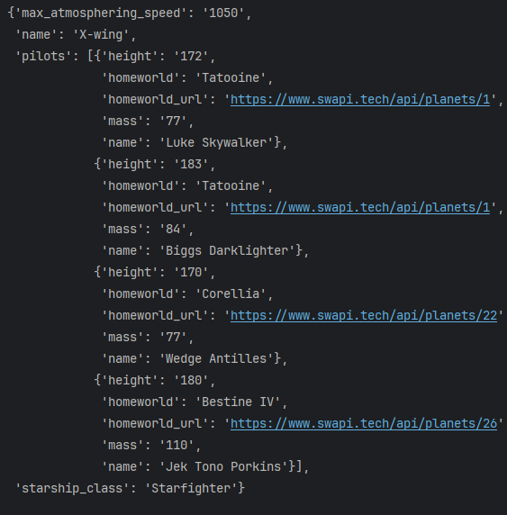
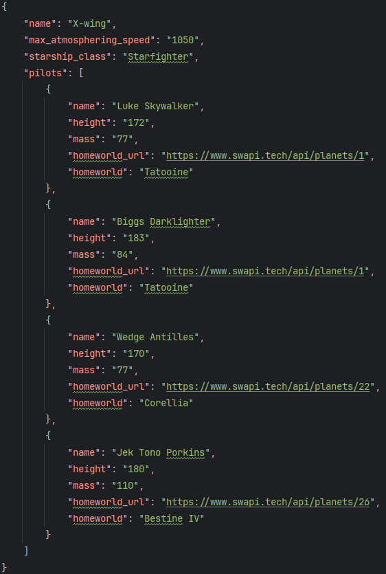

## Цели практической работы
- Отработать умение получать данные с сайта и API.
- Закрепить работу с форматом JSON, использованием методов для сериализации и десериализации.


## Задача 1. May the force be with you
### Что нужно сделать
Фанаты «Звёздных войн» (Star Wars) написали API по своей любимой вселенной. Ссылка на документацию: https://www.swapi.tech/documentation

Внимательно изучите документацию этого API и напишите программу, которая выводит на экран (и в JSON-файл) информацию о пилотах легендарного истребителя `X-wing`.  
Информация о корабле должна содержать следующие пункты:
- название,
- максимальная скорость,
- класс,
- список пилотов.

Внутри списка о каждом пилоте должна быть следующая информация:
- имя,
- рост,
- вес,
- родная планета,
- ссылка на информацию о родной планете.

#### Пример вывода информации по кораблю X-wing в консоль:

#### Информация в файле будет выглядеть так:


### Что оценивается

- Результат вычислений корректен.
- Информация собрана в словарь с правильной структурой.
- Переменные, функции и собственные методы классов имеют значащие имена (не a, b, c, d).


## Задача 2. JSON comparison

### Что нужно сделать
Найдите различия между двумя JSON-файлами. Если различающиеся параметры входят в `diff_list`, выведите различие. Иными словами, вам нужно отловить изменение определённых параметров и вывести значение: что изменилось и на что. Набор ключей в обоих файлах идентичный, различаются лишь значения.

#### Напишите программу, которая: 

1) загружает данные из двух предложенных JSON-файлов (находятся в репозитории);
2) выполняет сравнение параметров, указанных в `diff_list`;
3) формирует результат в виде словаря;
4) записывает словарь в JSON-файл с названием `result.json`.

#### Исходные данные
Файлы: 
- `json_old.json`,
- `json_new.json`.

#### Список параметров для отслеживания (можно сформировать с помощью функции `input` или ввести вручную):
```python
diff_list = ["services", "staff", "datetime"]
```
Формат итогового словаря с результатом:  
Словарь {параметр: новое_значение, ….}
### Пример:
**Данные, загруженные из `json_old.json`:**
```python
{
    "company_id": 111111,
    "resource": "record",
    "resource_id": 406155061,
    "status": "create",
    "data": {
        "data_id": 11111111,
        "company_id": 111111,
        "services": [
            {
                "service_id": 9035445,
                "title": "Стрижка",
                "cost": 1500,
                "cost_per_unit": 1500,
                "first_cost": 1500,
                "amount": 1
            }
        ],
        "goods_transactions": [],
        "staff": {
            "staff_id": 1819441,
            "name": "Мастер"
        },
        "client": {
            "client_id": 130345867,
            "name": "Клиент",
            "phone": "79111111111",
            "success_visits_count": 2,
            "fail_visits_count": 0
        },
        "clients_count": 1,
        "datetime": "2022-01-25T11:00:00+03:00",
        "create_date": "2022-01-22T00:54:00+03:00",
        "online": false,
        "attendance": 0,
        "confirmed": 1,
        "seance_length": 3600,
        "length": 3600,
        "master_request": 1,
        "visit_id": 346427049,
        "created_user_id": 10573443,
        "deleted": false,
        "paid_full": 0,
        "last_change_date": "2022-01-22T00:54:00+03:00",
        "record_labels": "",
        "date": "2022-01-22 10:00:00"
    }
}
```
**Данные, загруженные из `json_new.json`:**
```python
{
    "company_id": 111111,
    "resource": "record",
    "resource_id": 406155061,
    "status": "create",
    "data": {
        "data_id": 11111111,
        "company_id": 111111,
        "services": [
            {
                "service_id": 22222225,
                "title": "Стрижка",
                "cost": 1200,
                "cost_per_unit": 1500,
                "first_cost": 1500,
                "amount": 1
            }
        ],
        "goods_transactions": [],
        "staff": {
            "staff_id": 1819441,
            "name": "Мастер"
        },
        "client": {
            "client_id": 130345867,
            "name": "Клиент",
            "phone": "79111111111",
            "success_visits_count": 2,
            "fail_visits_count": 0
        },
        "clients_count": 1,
        "datetime": "2022-01-25T13:00:00+03:00",
        "create_date": "2022-01-22T00:54:00+03:00",
        "online": false,
        "attendance": 2,
        "confirmed": 1,
        "seance_length": 3600,
        "length": 3600,
        "master_request": 1,
        "visit_id": 346427049,
        "created_user_id": 10573443,
        "deleted": false,
        "paid_full": 1,
        "last_change_date": "2022-01-22T00:54:00+03:00",
        "record_labels": "",
        "date": "2022-01-22 10:00:00"
    }
}
```
**Пример 1:**
```python
diff_list = ["services", "staff", "datetime"]
```
**Результат:**
```python
print(result)
```
В консоли должно вывестись следующее сообщение:
```python
{'services': [
    {'service_id': 22222225,
     'title': 'Стрижка',
     'cost': 1200,
     'cost_per_unit': 1500,
     'first_cost': 1500,
     'amount': 1}],
    'datetime': '2022-01-25T13:00:00+03:00'
}
```
**Пример 2:**
```python
diff_list = ["cost", "datetime"]
```
**Результат:**
```python
print(result)
```
В консоли должно вывестись следующее сообщение:
```python
{'cost': 1200, 'datetime': '2022-01-25T13:00:00+03:00'}
```
Помимо вывода в консоль, должен быть сформирован JSON-файл с получившимся словарём (`result.json`).
Обратите внимание: в `result` представлены не все изменившиеся поля, а лишь те, что объявлены в `diff_list`.


### Что оценивается
- Данные корректно загружены из файлов.
- Формат вывода соответствует примеру.
- Выведены только те различия, которые указаны в diff_list.
- Выполнение кода приводит к созданию файла result.json с найденными различиями.
- Переменные, функции и собственные методы классов имеют значащие имена (не a, b, c, d).
